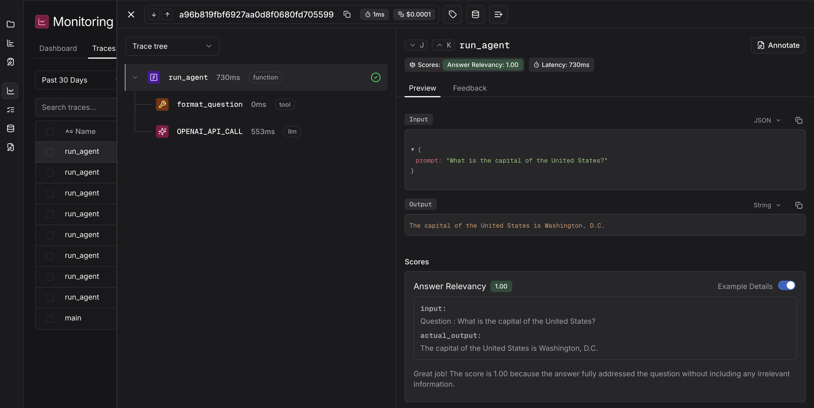
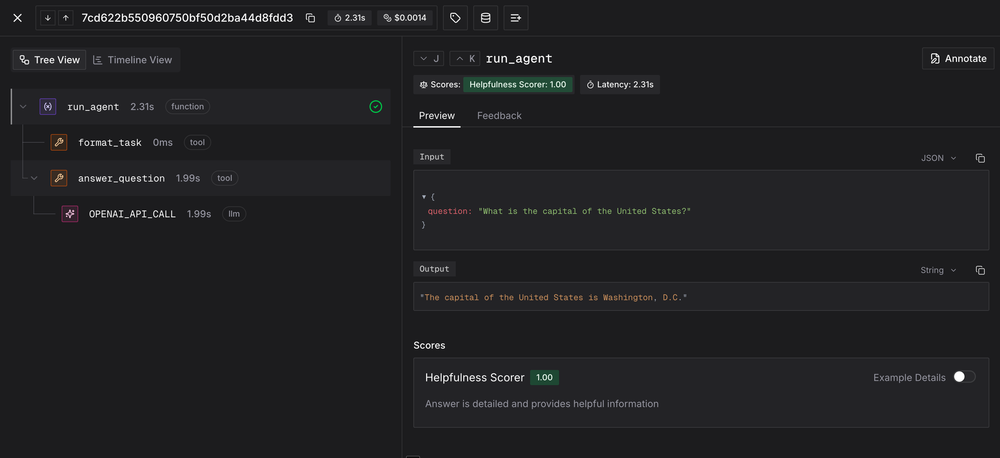

<div align="center">

<a href="https://judgmentlabs.ai/">
  <picture>
    <source media="(prefers-color-scheme: dark)" srcset="assets/logo_darkmode.svg">
    
  </picture>
</a>

<br>

## Agent Behavior Monitoring (ABM)

Track and judge any agent behavior in online and offline setups. Set up Sentry-style alerts and analyze agent behaviors / topic patterns at scale! 

[](https://docs.judgmentlabs.ai/documentation)
[](https://app.judgmentlabs.ai/register)
[](https://docs.judgmentlabs.ai/documentation/self-hosting/get-started)


[](https://x.com/JudgmentLabs)
[](https://www.linkedin.com/company/judgmentlabs)

</div>


</table>

## Judgeval Overview

Judgeval is an open-source framework for agent behavior monitoring. Judgeval offers a toolkit to track and judge agent behavior in online and offline setups, enabling you to convert interaction data from production/test environments into improved agents. To get started, try running one of the notebooks below or dive deeper in our [docs](https://docs.judgmentlabs.ai/documentation).

Our mission is to unlock the power of production data for agent development, enabling teams to improve their apps by catching real-time failures and optimizing over their users' preferences.

## 📚 Cookbooks

| Try Out | Notebook | Description |
|:---------|:-----|:------------|
| Custom Scorers | [Get Started For Free] | Build custom evaluators for your agents |
| Online ABM | [Get Started For Free] | Monitor agent behavior in production |
| Offline Testing | [Get Started For Free] | Compare how different prompts, models, or agent configs affect performance across ANY metric |


You can access our repo of cookbooks [here](https://github.com/JudgmentLabs/judgeval-cookbook).

You can find a list of video tutorials for Judgeval use cases [here]((https://img.shields.io/badge/Documentation-blue)).


## Why Judgeval?

⚙️ **Custom Evaluators**: No restriction to only monitoring with prefab scorers. Judgeval provides simple abstractions for custom python evaluators and their applications, supporting any LLM-as-a-judge rubrics/models and code-based scorers that integrate to our live agent-tracking infrastructure. [Learn more](https://docs.judgmentlabs.ai/documentation/evaluation/scorers/custom-scorers)

🚨 **Production Monitoring**: Run any custom scorer in a hosted, virtualized secure container to flag agent behaviors online in production. Get Slack alerts for failures and add custom hooks to address regressions before they impact users. [Learn more](https://docs.judgmentlabs.ai/documentation/performance/online-evals)

📊 **Behavior/Topic Grouping**: Group agent runs by behavior type or topic for deeper analysis. Drill down into subsets of users, agents, or use cases to reveal patterns of agent behavior.
<!-- 
TODO: Once we have trainer code docs, plug in here
-->

🧪 **Experiment with evals**: Try out different prompts, models, or agent configs, then test for improvement with any agent behavior evaluator. Visualize and compare results over time! [Learn more](https://docs.judgmentlabs.ai/documentation/evaluation/introduction)

<!--


|  |  |
|:---|:---:|
| <h3>🧪 Evals</h3>Build custom evaluators on top of your agents. Judgeval supports LLM-as-a-judge, manual labeling, and code-based evaluators that connect with our metric-tracking infrastructure. <br><br>**Useful for:**<br>• ⚠️ Unit-testing <br>• 🔬 A/B testing <br>• 🛡️ Online guardrails | <p align="center"></p> |
| <h3>📡 Monitoring</h3>Get Slack alerts for agent failures in production. Add custom hooks to address production regressions.<br><br> **Useful for:** <br>• 📉 Identifying degradation early <br>• 📈 Visualizing performance trends across agent versions and time | <p align="center"></p> |
| <h3>📊 Datasets</h3>Export environment interactions and test cases to datasets for scaled analysis and optimization. Move datasets to/from Parquet, S3, etc. <br><br>Run evals on datasets as unit tests or to A/B test different agent configurations, enabling continuous learning from production interactions. <br><br> **Useful for:**<br>• 🗃️ Agent environment interaction data for optimization<br>• 🔄 Scaled analysis for A/B tests | <p align="center"></p> |

-->

## 🛠️ Quickstart

Get started with Judgeval by installing our SDK using pip:

```bash
pip install judgeval
```

Ensure you have your `JUDGMENT_API_KEY` and `JUDGMENT_ORG_ID` environment variables set to connect to the [Judgment Platform](https://app.judgmentlabs.ai/).

```bash
export JUDGMENT_API_KEY=...
export JUDGMENT_ORG_ID=...
```

**If you don't have keys, [create an account for free](https://app.judgmentlabs.ai/register) on the platform!**

### Start monitoring with Judgeval

```python
from judgeval.tracer import Tracer, wrap
from judgeval.data import Example
from judgeval.scorers import AnswerRelevancyScorer
from openai import OpenAI


judgment = Tracer(project_name="default_project")
client = wrap(OpenAI())  # tracks all LLM calls

@judgment.observe(span_type="tool")
def format_question(question: str) -> str:
    # dummy tool
    return f"Question : {question}"

@judgment.observe(span_type="function")
def run_agent(prompt: str) -> str:
    task = format_question(prompt)
    response = client.chat.completions.create(
        model="gpt-4.1",
        messages=[{"role": "user", "content": task}]
    )

    judgment.async_evaluate(  # trigger online monitoring
        scorer=AnswerRelevancyScorer(threshold=0.5),  # swap with any scorer
        example=Example(input=task, actual_output=response),  # customize to your data
        model="gpt-5",
    )
    return response.choices[0].message.content

run_agent("What is the capital of the United States?")
```

Running this code will deliver monitoring results to your [free platform account](https://app.judgmentlabs.ai/register) and should look like this:




### Customizable Scorers Over Agent Behavior

Judgeval's strongest suit is the full customization over the types of scorers you can run online monitoring with. No restrictions to only single-prompt LLM judges or prefab scorers - if you can express your scorer
in python code, judgeval can monitor it! Under the hood, judgeval hosts your scorer in a virtualized secure container, enabling online monitoring for any scorer.


First, create a behavior scorer in a file called `helpfulness_scorer.py`:

```python
from judgeval.data import Example
from judgeval.scorers.example_scorer import ExampleScorer

# Define custom example class
class QuestionAnswer(Example):
    question: str
    answer: str

# Define a server-hosted custom scorer
class HelpfulnessScorer(ExampleScorer):
    name: str = "Helpfulness Scorer"
    server_hosted: bool = True  # Enable server hosting
    async def a_score_example(self, example: QuestionAnswer):
        # Custom scoring logic for agent behavior
        # Can be an arbitrary combination of code and LLM calls
        if len(example.answer) > 10 and "?" not in example.answer:
            self.reason = "Answer is detailed and provides helpful information"
            return 1.0
        else:
            self.reason = "Answer is too brief or unclear"
            return 0.0
```

Then deploy your scorer to Judgment's infrastructure:

```bash
echo "pydantic" > requirements.txt
judgeval upload_scorer helpfulness_scorer.py requirements.txt
```

Now you can instrument your agent with monitoring and online evaluation:

```python
from judgeval.tracer import Tracer, wrap
from helpfulness_scorer import HelpfulnessScorer, QuestionAnswer
from openai import OpenAI

judgment = Tracer(project_name="default_project")
client = wrap(OpenAI())  # tracks all LLM calls

@judgment.observe(span_type="tool")
def format_task(question: str) -> str:  # replace with your prompt engineering
    return f"Please answer the following question: {question}"

@judgment.observe(span_type="tool")
def answer_question(prompt: str) -> str:  # replace with your LLM system calls
    response = client.chat.completions.create(
        model="gpt-4",
        messages=[{"role": "user", "content": prompt}]
    )
    return response.choices[0].message.content

@judgment.observe(span_type="function")
def run_agent(question: str) -> str:
    task = format_task(question)
    answer = answer_question(task)

    # Add online evaluation with server-hosted scorer
    judgment.async_evaluate(
        scorer=HelpfulnessScorer(),
        example=QuestionAnswer(question=question, answer=answer),
        sampling_rate=0.9  # Evaluate 90% of agent runs
    )

    return answer

if __name__ == "__main__":
    result = run_agent("What is the capital of the United States?")
    print(result)
```

Congratulations! Your online eval result should look like this:



You can now run any online scorer in a virtualized container with no latency impact on your applications.

<!--
```python
from judgeval.tracer import Tracer, wrap
from judgeval.data import Example
from judgeval.scorers.example_scorer import ExampleScorer
from openai import OpenAI

judgment = Tracer(project_name="default_project")
client = wrap(OpenAI())

class CustomerRequest(Example):  # Define a custom example class
    request: str
    response: str

class ResolutionScorer(ExampleScorer):  # Define a agent-specific custom scorer
    name: str = "Resolution Scorer"
    server_hosted: bool = True  # Executes scorer in a virtualized secure container

    async def a_score_example(self, example: CustomerRequest):
      # Custom scoring logic for agent behavior. Import dependencies, combine LLM judge with logic, and more
        if "package" in example.response.lower():  
            self.reason = "The response addresses the package inquiry"
            return 1.0
        else:
            self.reason = "The response does not address the package inquiry"
            return 0.0


@judgment.observe(span_type="function")
def run_agent():
    customer_request = "When is my package coming?" # fill in with actual customer request
    response = "Your pizza is coming in 10 days!" # fill in with actual agent invocation

    # Run online evaluation with custom scorer
    judgment.async_evaluate(
        scorer=ResolutionScorer(threshold=0.8),
        example=CustomerRequest(
            request=customer_request,
            response=response
        )
    )
    return response

run_agent()
```

## 🏢 Self-Hosting

Run Judgment on your own infrastructure: we provide comprehensive self-hosting capabilities that give you full control over the backend and data plane that Judgeval interfaces with.

### Key Features
* Deploy Judgment on your own AWS account
* Store data in your own Supabase instance
* Access Judgment through your own custom domain

### Getting Started
1. Check out our [self-hosting documentation](https://docs.judgmentlabs.ai/documentation/self-hosting/get-started) for detailed setup instructions, along with how your self-hosted instance can be accessed
2. Use the [Judgment CLI](https://docs.judgmentlabs.ai/documentation/developer-tools/judgment-cli/installation) to deploy your self-hosted environment
3. After your self-hosted instance is setup, make sure the `JUDGMENT_API_URL` environmental variable is set to your self-hosted backend endpoint

## 💻 Development with Cursor
Building agents and LLM workflows in Cursor works best when your coding assistant has the proper context about Judgment integration. The Cursor rules file contains the key information needed for your assistant to implement Judgment features effectively.

Refer to the official [documentation](https://docs.judgmentlabs.ai/documentation/developer-tools/cursor/cursor-rules) for access to the rules file and more information on integrating this rules file with your codebase.
-->


## ⭐ Star Us

If you find Judgeval useful, please consider giving us a star! Your support helps us grow our community and continue improving the repository.

## ❤️ Contributors

There are many ways to contribute to Judgeval:

- Submit [bug reports](https://github.com/JudgmentLabs/judgeval/issues) and [feature requests](https://github.com/JudgmentLabs/judgeval/issues)
- Review the documentation and submit [Pull Requests](https://github.com/JudgmentLabs/judgeval/pulls) to improve it
- Speaking or writing about Judgment and letting us know!

<!-- Contributors collage -->
[](https://github.com/JudgmentLabs/judgeval/graphs/contributors)

---

Judgeval is created and maintained by [Judgment Labs](https://judgmentlabs.ai/).
