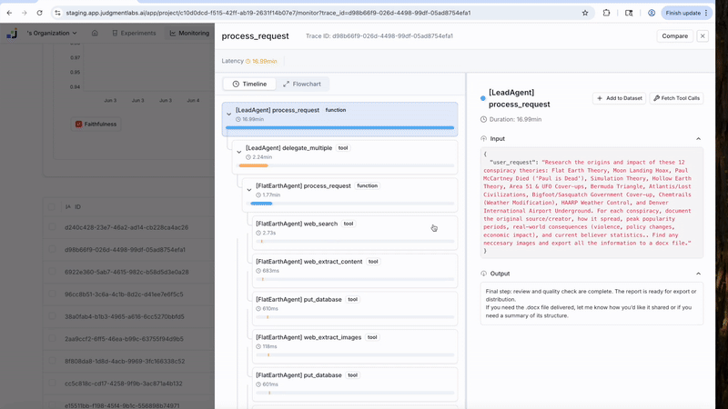
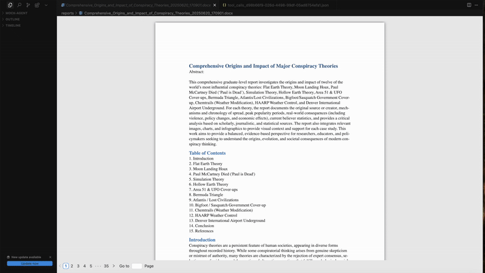
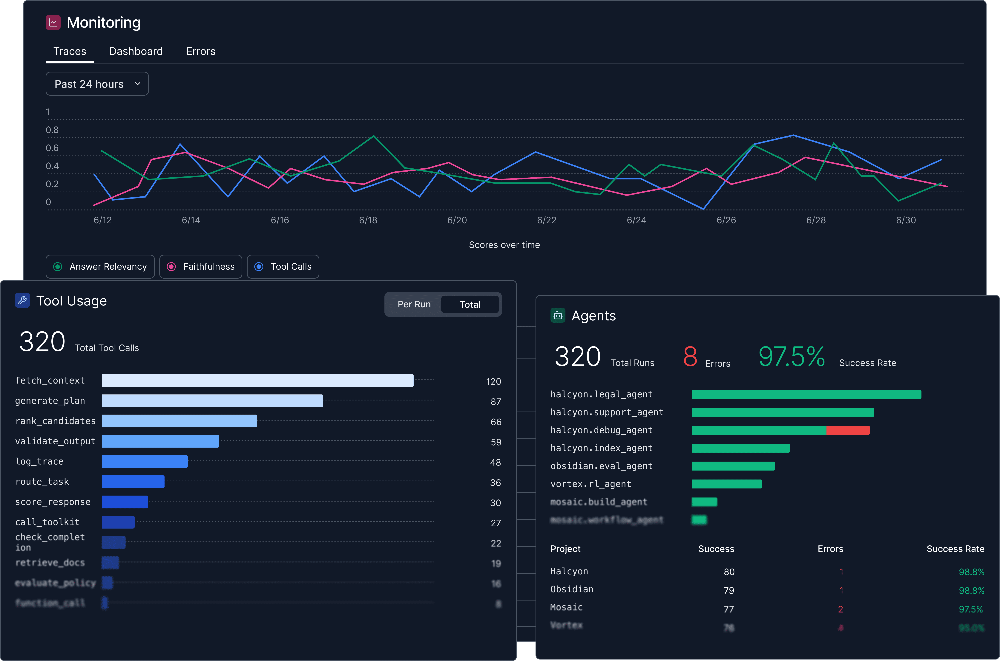
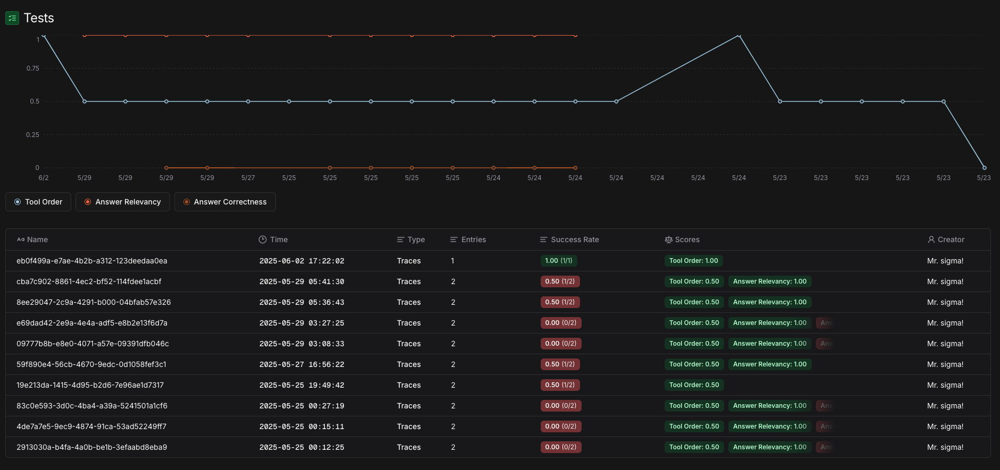
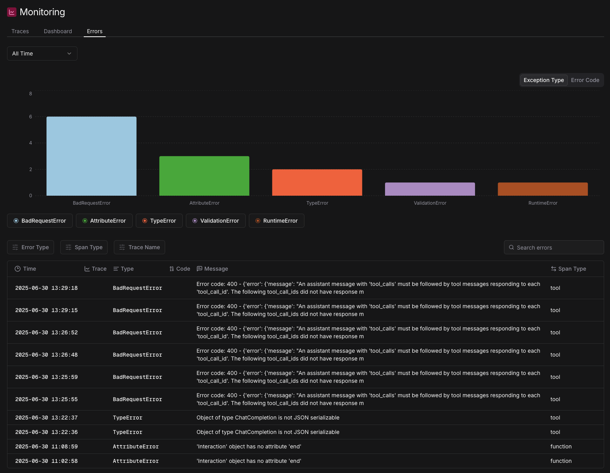
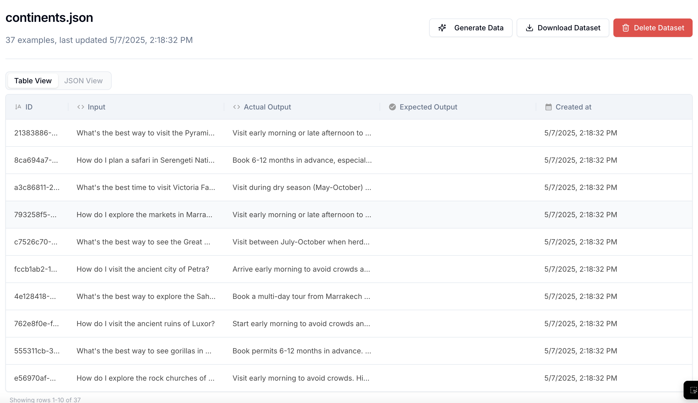

<div align="center">

<a href="https://judgmentlabs.ai/"></a>
<a href="https://judgmentlabs.ai/"></a>

<br>
<div style="font-size: 1.5em;">
    Monitor Agent Behavior.
</div>

## [Docs](https://docs.judgmentlabs.ai/)  •  [Judgment Cloud](https://app.judgmentlabs.ai/register)  • [Self-Host](https://docs.judgmentlabs.ai/documentation/self-hosting/get-started)

<!-- 
[Bug Reports](https://github.com/JudgmentLabs/judgeval/issues) • [Changelog](https://docs.judgmentlabs.ai/changelog/2025-04-21)
-->

[](https://x.com/JudgmentLabs)
[](https://www.linkedin.com/company/judgmentlabs)
[](https://discord.gg/tGVFf8UBUY)

</div>


<!-- 
## 🎬 See Judgeval in Action

**[Multi-Agent System](https://github.com/JudgmentLabs/judgment-cookbook/tree/main/cookbooks/agents/multi-agent) with complete observability:** (1) A multi-agent system spawns agents to research topics on the internet. (2) With just **3 lines of code**, Judgeval captures all environment responses across all agent tool calls for monitoring. (3) After completion, (4) export all interaction data to enable further environment-specific learning and optimization.

<table style="width: 100%; max-width: 800px; table-layout: fixed;">
<tr>
<td align="center" style="padding: 8px; width: 50%;">
  
  <br><strong>🤖 Agents Running</strong>
</td>
<td align="center" style="padding: 8px; width: 50%;">
  
  <br><strong>📊 Capturing Environment Data </strong>
</td>
</tr>
<tr>
<td align="center" style="padding: 8px; width: 50%;">
  
  <br><strong>✅ Agents Completed Running</strong>
</td>
<td align="center" style="padding: 8px; width: 50%;">
  
  <br><strong>📤 Exporting Agent Environment Data</strong>
</td>
</tr>
-->

</table>

<!-- 
## 📋 Table of Contents
- [🛠️ Installation](#️-installation)
- [🏁 Quickstarts](#-quickstarts)
- [✨ Features](#-features)
- [🏢 Self-Hosting](#-self-hosting)
- [📚 Cookbooks](#-cookbooks)
- [💻 Development with Cursor](#-development-with-cursor)
-->

## 🛠️ Quickstart

Get started with Judgeval by installing our SDK using pip:

```bash
pip install judgeval
```

Ensure you have your `JUDGMENT_API_KEY` and `JUDGMENT_ORG_ID` environment variables set to connect to the [Judgment Platform](https://app.judgmentlabs.ai/).

```bash
export JUDGMENT_API_KEY=...
export JUDGMENT_ORG_ID=...
```

**If you don't have keys, [create an account](https://app.judgmentlabs.ai/register) on the platform!**

## 📊 Monitor Your Agent

Add monitoring to your agent with just a few lines of code. Here's a complete example of a customer support agent that uses LLM-based decision making and gets evaluated by an LLM judge.

### 1. Define Your Custom Scorer

First, create a custom scorer that evaluates whether your agent made the right decision:

```python
from judgeval.common.tracer import Tracer, wrap
from judgeval.scorers import ExampleScorer
from judgeval.data import Example
from openai import OpenAI

import json
import re


# Example: Defines the data structure for your evaluation inputs
class CustomerExample(Example):
    # Customer support specific fields
    customer_message: str  # The customer's original message
    plan: str  # The agent's reasoning/plan
    result: str  # The system's response


# ExampleScorer: Base class for creating custom evaluation logic
class SupportAgentScorer(ExampleScorer):
    name: str = "Support Agent Decision Quality"

    async def a_score_example(self, example: CustomerExample):
        try:
            response = OpenAI().client.chat.completions.create(
                
                messages=[
                    {"role": "system", "content": """You are an expert at evaluating customer support agents. 
                    
                    Evaluate if the agent made the RIGHT DECISION based on:
                    1. The customer's message and situation
                    2. The agent's plan/reasoning
                    3. The final result/action taken
                    
                    Score 1.0 if the agent made the correct decision, 0.0 if wrong.
                    
                    Consider:
                    - Did the agent correctly understand the customer's issue?
                    - Was their reasoning logical and appropriate?
                    - Did the final action match their plan and solve the customer's problem?
                    - Was the tool choice (approve_refund vs deny_refund) appropriate for the situation?"""},

                    {"role": "user", "content": f"""Customer Message: {example.customer_message}
                    
                    Agent's Plan: {example.plan}
                    Agent's Result: {example.result}

                    Did the agent make the right decision? 

                    Please respond in this exact format:
                    Score: [0.0-1.0]
                    Reason: [Your explanation here]"""}
                ]
                model="gpt-4.1",
            ).choices[0].messages.content
            
            # Extract score using the structured format
            score_match = re.search(r'Score:\s*(\d+\.?\d*)', response)
            score = float(score_match.group(1)) if score_match else 0.0
            
            # Extract reason
            reason_match = re.search(r'Reason:\s*(.*)', response, re.DOTALL)
            reason = reason_match.group(1).strip() if reason_match else "No reason provided"
            
            self.reason = reason
            
            return score
        except Exception as e:
            self.error = str(e)
            return 0.0

```

### 2. Set Up Your Agent with Tools

Next, wrap your LLM client and define the tools your agent can use:

```python
judgment = Tracer(project_name="customer_support_agent")
client = wrap(OpenAI())

@judgment.observe(span_type="tool")
def approve_refund(customer_id: str, amount: int) -> str:
    # Agent decided to approve the refund
    return f"Refund of ${amount} approved for customer {customer_id}. Will be processed within 3-5 business days"

@judgment.observe(span_type="tool")
def deny_refund(customer_id: str) -> str:
    # Agent decided to deny the refund
    return f"Refund denied for customer {customer_id}. Does not qualify for refund policy"

# ... other tools ...

@judgment.observe(span_type="function")
def support_agent(customer_message: str) -> str:
    # Step 1: Use LLM to analyze the customer's message and plan response
    response = client.chat.completions.create(
        messages=[
            {"role": "system", "content": """You are a customer support agent. Analyze the customer message and create a plan to help them.

            Available tools:
            - approve_refund(customer_id, amount): Approve refund for customer
            - deny_refund(customer_id): Deny refund for customer

            Format your response as:
            <plan>Your analysis of the customer's issue and reasoning for your tool choice</plan>
            <tool>
            {"name": "tool_name", "args": {"parameter": "value"}}
            </tool>

            Explain your reasoning for choosing the tool based on the customer's request."""},
            {"role": "user", "content": customer_message}
        ],
        model="gpt-4.1"

    ).choices[0].message.content

    # Step 2: Parse the <plan> and <tool> tags from LLM response
    plan_match = re.search(r'<plan>\s*(.*?)\s*</plan>', response, re.DOTALL)
    plan = plan_match.group(1) if plan_match else "No plan found"
    
    tool_match = re.search(r'<tool>\s*(\{.*?\})\s*</tool>', response, re.DOTALL)
    tool_json = tool_match.group(1)

    params = json.loads(tool_json)
    tool_name = params["name"]
    args = params["args"]
    
    # Step 3: Execute the function based on tool name
    if tool_name == "approve_refund":
        result = approve_refund(args["customer_id"], args["amount"])
    elif tool_name == "deny_refund":
        result = deny_refund(args["customer_id"])
    else:
        result = "Unknown tool requested"
    
    # Step 4: Check if the agent's behavior was reasonable
    judgment.async_evaluate(
        scorer=SupportAgentScorer(),
        example=CustomerExample(
            customer_message=customer_message,
            plan=plan,
            result=result
        ),
        sampling_rate=0.25 # evaluating online 25% of agent behaviors
    )
    return response
if __name__ == "__main__":
    # Example customer message
    customer_message = "Hi, I received a defective product and would like a refund. My order ID is #12345 and the item arrived broken."
    result = support_agent(customer_message)
```

**That's it!** Your agent is now being monitored. Check your [Judgment Dashboard](https://app.judgmentlabs.ai/) to see the results. 

## ✨ Features




|  |  |
|:---|:---:|
| <h3>🧪 Evals</h3>Build custom evaluators on top of your agents. Judgeval supports LLM-as-a-judge, manual labeling, and code-based evaluators that connect with our metric-tracking infrastructure. <br><br>**Useful for:**<br>• ⚠️ Unit-testing <br>• 🔬 A/B testing <br>• 🛡️ Online guardrails | <p align="center"></p> |
| <h3>📡 Monitoring</h3>Get Slack alerts for agent failures in production. Add custom hooks to address production regressions.<br><br> **Useful for:** <br>• 📉 Identifying degradation early <br>• 📈 Visualizing performance trends across agent versions and time | <p align="center"></p> |
| <h3>📊 Datasets</h3>Export environment interactions and test cases to datasets for scaled analysis and optimization. Move datasets to/from Parquet, S3, etc. <br><br>Run evals on datasets as unit tests or to A/B test different agent configurations, enabling continuous learning from production interactions. <br><br> **Useful for:**<br>• 🗃️ Agent environment interaction data for optimization<br>• 🔄 Scaled analysis for A/B tests | <p align="center"></p> |

## 🏢 Self-Hosting

Run Judgment on your own infrastructure: we provide comprehensive self-hosting capabilities that give you full control over the backend and data plane that Judgeval interfaces with.

### Key Features
* Deploy Judgment on your own AWS account
* Store data in your own Supabase instance
* Access Judgment through your own custom domain

### Getting Started
1. Check out our [self-hosting documentation](https://docs.judgmentlabs.ai/documentation/self-hosting/get-started) for detailed setup instructions, along with how your self-hosted instance can be accessed
2. Use the [Judgment CLI](https://docs.judgmentlabs.ai/documentation/developer-tools/judgment-cli/installation) to deploy your self-hosted environment
3. After your self-hosted instance is setup, make sure the `JUDGMENT_API_URL` environmental variable is set to your self-hosted backend endpoint

## 📚 Cookbooks

Have your own? We're happy to feature it if you create a PR or message us on [Discord](https://discord.gg/tGVFf8UBUY).

You can access our repo of cookbooks [here](https://github.com/JudgmentLabs/judgment-cookbook).

## 💻 Development with Cursor
Building agents and LLM workflows in Cursor works best when your coding assistant has the proper context about Judgment integration. The Cursor rules file contains the key information needed for your assistant to implement Judgment features effectively.

Refer to the official [documentation](https://docs.judgmentlabs.ai/documentation/developer-tools/cursor/cursor-rules) for access to the rules file and more information on integrating this rules file with your codebase.

## ⭐ Star Us on GitHub

If you find Judgeval useful, please consider giving us a star on GitHub! Your support helps us grow our community and continue improving the repository.

## ❤️ Contributors

There are many ways to contribute to Judgeval:

- Submit [bug reports](https://github.com/JudgmentLabs/judgeval/issues) and [feature requests](https://github.com/JudgmentLabs/judgeval/issues)
- Review the documentation and submit [Pull Requests](https://github.com/JudgmentLabs/judgeval/pulls) to improve it
- Speaking or writing about Judgment and letting us know!

<!-- Contributors collage -->
[](https://github.com/JudgmentLabs/judgeval/graphs/contributors)

---

Judgeval is created and maintained by [Judgment Labs](https://judgmentlabs.ai/).
