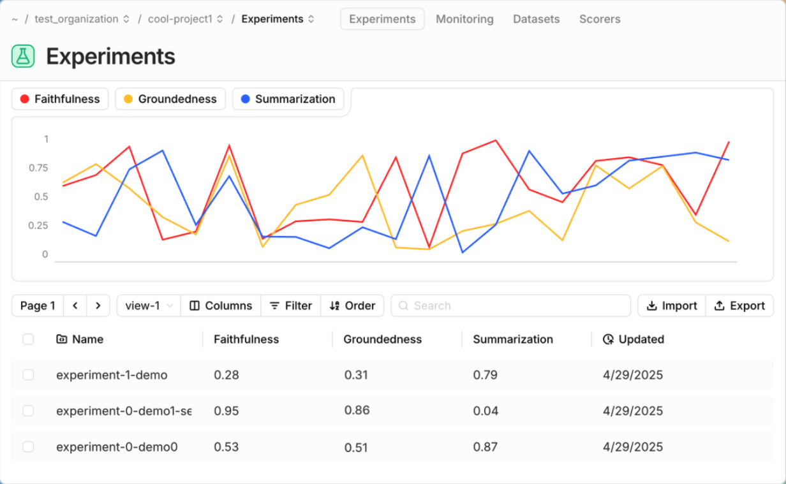
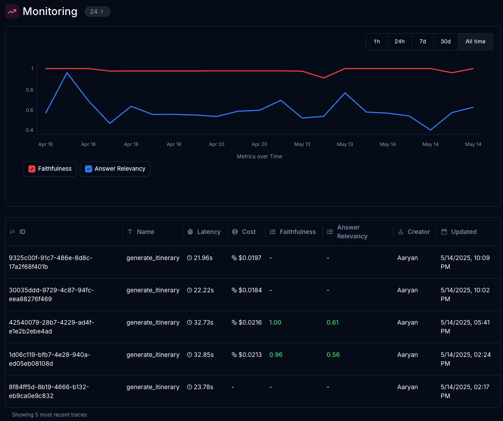
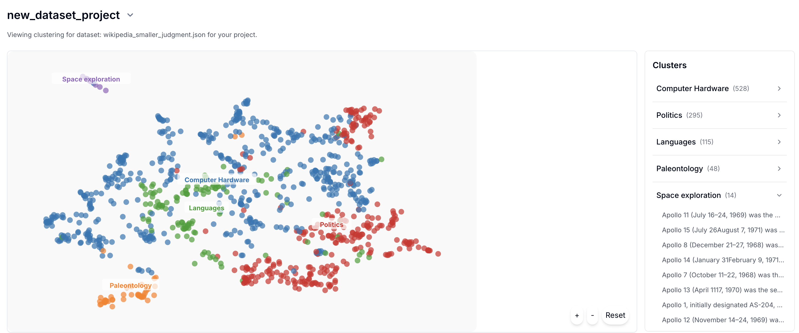

<div align="center">


**Build monitoring & evaluation pipelines for complex agents**



<br>

## [🌐 Landing Page](https://www.judgmentlabs.ai/) • [Twitter/X](https://x.com/JudgmentLabs) • [💼 LinkedIn](https://www.linkedin.com/company/judgmentlabs) • [📚 Docs](https://judgment.mintlify.app/getting_started) • [🚀 Demos](https://www.youtube.com/@AlexShan-j3o) • [🎮 Discord](https://discord.gg/taAufyhf)
</div>

## Judgeval: open-source testing, monitoring, and optimization for AI agents

Judgeval offers robust tooling for evaluating and tracing LLM agent systems. It is dev-friendly and open-source (licensed under Apache 2.0). 

Judgeval gets you started in five minutes, after which you'll be ready to use all of its features as your agent becomes more complex. Judgeval is natively connected to the [Judgment Platform](https://www.judgmentlabs.ai/) for free and you can export your data and self-host at any time.

We support LangGraph, OpenAI SDK, Anthropic, etc. agents and allow custom eval integrations for any use case. Check out our quickstarts below or our [setup guide](https://judgment.mintlify.app/getting_started) to get started.

Judgeval is created and maintained by [Judgment Labs](https://judgmentlabs.ai/).

## 📋 Table of Contents

- [✨ Features](#features)
  - [🔍 Tracing](#tracing)
  - [🧪 Evals](#evals)
  - [📡 Monitoring](#monitoring)
  - [📊 Datasets](#datasets)
  - [💡 Insights](#insights)
- [🛠️ Installation](#installation)
- [🏁 Get Started](#get-started)
- [🏠 Self-hosting](#self-hosting)
- [📚 Cookbooks](#cookbooks)
- [❤️ Contributors](#contributors)


## ✨ Features

|  |  |
|:---|:---:|
| <h3>🔠Tracing</h3>Automatic agent tracing integrated with common frameworks (LangGraph, OpenAI, Anthropic): **tracking inputs/outputs, latency, and cost** at every step.<br><br>Online evals can be applied to traces to measure quality on production data—supports real-time. | <p align="center"></p> |
| <h3>🧪 Evals</h3>15+ research-backed metrics including tool call accuracy, hallucinations, instruction adherence, and retrieval context recall.<br><br>Build custom evaluators that connect with our metric-tracking infrastructure. **Useful for unit-testing ⚠️, experimental prompt testing 🔬, and online guardrails 🛡️.**<br><br> | <p align="center"></p> |
| <h3>📡 Monitoring</h3>Real-time performance tracking of your agents in production environments. **Track all your metrics in one place.**<br><br>Set up Slack/email alerts for critical metrics and receive notifications when thresholds are exceeded.<br>Visualize agent performance trends over time to identify degradation early.<br><br> | <p align="center"></p> |
| <h3>📊 Datasets</h3>Export trace data or import external testcases to datasets hosted on Judgment's Platform. Move datasets to/from Parquet, S3, etc. <br><br>Run evals on datasets as unit tests or to A/B test different agent configurations. | <p align="center"></p> |
| <h3>💡 Insights</h3>Error clustering groups agent failures to uncover patterns and speed up root cause analysis.<br><br>Trace failures to their exact source with Judgment's Osiris agent, which localizes errors to specific components for precise fixes.<br><br> | <p align="center"></p> |

## 🛠️ Installation

Get started with Judgeval by installing our SDK using pip:

```bash
pip install judgeval
```

Ensure you have your `JUDGMENT_API_KEY` environment variable set to connect to the [Judgment platform](https://app.judgmentlabs.ai/). If you don't have a key, create an account on the platform!

## 🏁 Get Started

Here's how you can quickly start using Judgeval:

### 🛰️ Tracing

Track your agent execution with full observability with just a few lines of code.
Create a file named `traces.py` with the following code:

```python
from judgeval.common.tracer import Tracer, wrap
from openai import OpenAI

client = wrap(OpenAI())
judgment = Tracer(project_name="my_project")

@judgment.observe(span_type="tool")
def my_tool():
    return "What's the capital of the U.S.?"

@judgment.observe(span_type="function")
def main():
    task_input = my_tool()
    res = client.chat.completions.create(
        model="gpt-4.1",
        messages=[{"role": "user", "content": f"{task_input}"}]
    )
    return res.choices[0].message.content

main()
```

[Click here](https://judgment.mintlify.app/getting_started#create-your-first-trace) for a more detailed explanation.

### 📝 Offline Evaluations

You can evaluate your agent's execution to measure quality metrics such as hallucination.
Create a file named `evaluate.py` with the following code:

```python evaluate.py
from judgeval import JudgmentClient
from judgeval.data import Example
from judgeval.scorers import FaithfulnessScorer

client = JudgmentClient()

example = Example(
    input="What if these shoes don't fit?",
    actual_output="We offer a 30-day full refund at no extra cost.",
    retrieval_context=["All customers are eligible for a 30 day full refund at no extra cost."],
)

scorer = FaithfulnessScorer(threshold=0.5)
results = client.run_evaluation(
    examples=[example],
    scorers=[scorer],
    model="gpt-4.1",
)
print(results)
```

[Click here](https://judgment.mintlify.app/getting_started#create-your-first-experiment) for a more detailed explanation.

### 📡 Online Evaluations

Apply performance monitoring to measure the quality of your systems in production, not just on traces.

Using the same `traces.py` file we created earlier, modify `main` function:

```python
from judgeval.common.tracer import Tracer, wrap
from judgeval.scorers import AnswerRelevancyScorer
from openai import OpenAI

client = wrap(OpenAI())
judgment = Tracer(project_name="my_project")

@judgment.observe(span_type="tool")
def my_tool():
    return "Hello world!"

@judgment.observe(span_type="function")
def main():
    task_input = my_tool()
    res = client.chat.completions.create(
        model="gpt-4.1",
        messages=[{"role": "user", "content": f"{task_input}"}]
    ).choices[0].message.content

    judgment.get_current_trace().async_evaluate(
        scorers=[AnswerRelevancyScorer(threshold=0.5)],
        input=task_input,
        actual_output=res,
        model="gpt-4.1"
    )
    print("Online evaluation submitted.")
    return res

main()
```

[Click here](https://judgment.mintlify.app/getting_started#create-your-first-online-evaluation) for a more detailed explanation.

## 🏢 Self-Hosting

Run Judgment on your own infrastructure: we provide comprehensive self-hosting capabilities that give you full control over the backend and data plane that Judgeval interfaces with.

### Key Features
* Deploy Judgment on your own AWS account
* Store data in your own Supabase instance
* Access Judgment through your own custom domain

### Getting Started
1. Check out our [self-hosting documentation](https://judgment.mintlify.app/self_hosting/get_started) for detailed setup instructions, along with how your self-hosted instance can be accessed
2. Use the [Judgment CLI](https://github.com/JudgmentLabs/judgment-cli) to deploy your self-hosted environment
3. After your self-hosted instance is setup, make sure the `JUDGMENT_API_URL` environmental variable is set to your self-hosted backend endpoint

## 📚 Cookbooks

Have your own? We're happy to feature it if you create a PR or message us on [Discord](https://discord.gg/taAufyhf).

You can access our repo of cookbooks [here](https://github.com/JudgmentLabs/judgment-cookbook). Here are some highlights:

### Sample Agents

#### 💰 [LangGraph Financial QA Agent](https://github.com/JudgmentLabs/judgment-cookbook/blob/main/cookbooks/financial_agent/demo.py)
A LangGraph-based agent for financial queries, featuring RAG capabilities with a vector database for contextual data retrieval and evaluation of its reasoning and data accuracy.

#### ✈️ [OpenAI Travel Agent](https://github.com/JudgmentLabs/judgment-cookbook/blob/main/cookbooks/openai_travel_agent/agent.py)
A travel planning agent using OpenAI API calls, custom tool functions, and RAG with a vector database for up-to-date and contextual travel information. Evaluated for itinerary quality and information relevance.

### Custom Evaluators

#### 🔍 [PII Detection](https://github.com/JudgmentLabs/judgment-cookbook/blob/main/cookbooks/classifier_scorer/pii_checker.py)
Detecting and evaluating Personal Identifiable Information (PII) leakage.

#### 📧 [Cold Email Generation](https://github.com/JudgmentLabs/judgment-cookbook/blob/main/cookbooks/custom_scorers/cold_email_scorer.py)

Evaluates if a cold email generator properly utilizes all relevant information about the target recipient.

## ⭐ Star Us on GitHub

If you find Judgeval useful, please consider giving us a star on GitHub! Your support helps us grow our community and continue improving the product.


## ❤️ Contributors

There are many ways to contribute to Judgeval:

- Submit [bug reports](https://github.com/JudgmentLabs/judgeval/issues) and [feature requests](https://github.com/JudgmentLabs/judgeval/issues)
- Review the documentation and submit [Pull Requests](https://github.com/JudgmentLabs/judgeval/pulls) to improve it
- Speaking or writing about Judgment and letting us know!

<!-- Contributors collage -->
[](https://github.com/JudgmentLabs/judgeval/graphs/contributors)

